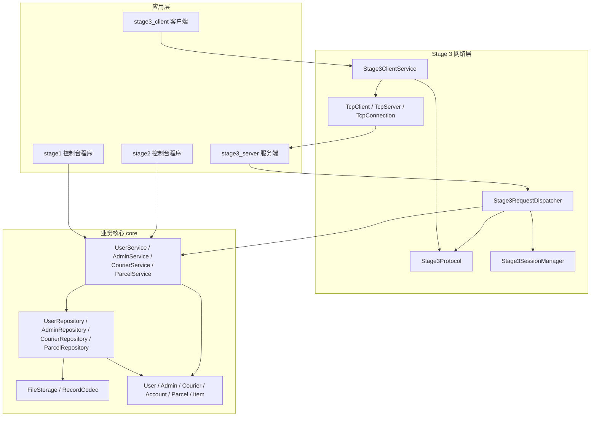
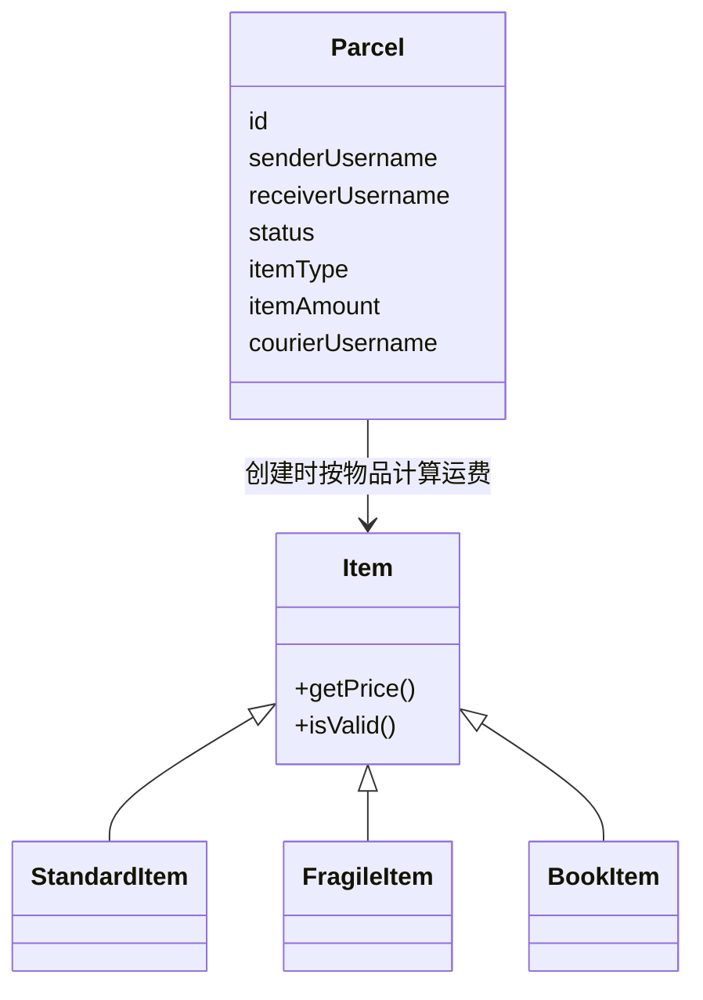
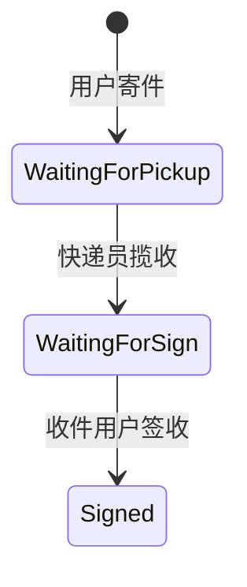
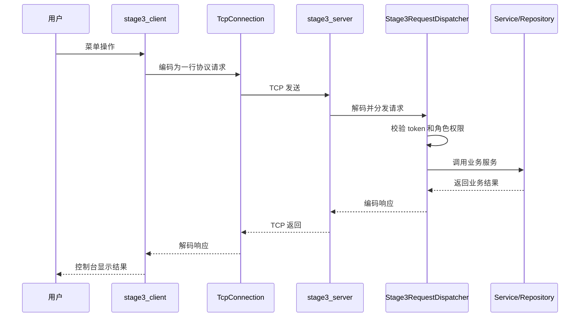

# 面向对象程序设计实践（C++）课程实验报告

题目：ExpressFlow 物流管理系统设计与实现  
姓名：  
学号：  
班级：  

## 目录

1. 前言  
2. 总体设计  
3. 详细设计  
   3.1 领域对象子系统详细设计  
   3.2 业务服务子系统详细设计  
   3.3 文件持久化子系统详细设计  
   3.4 控制台应用子系统详细设计  
   3.5 Stage 3 网络通信子系统详细设计  
   3.6 数据库说明  
   3.7 接口协议说明  
4. 实现  
   4.1 阶段式实现过程  
   4.2 关键问题和解决方案  
   4.3 测试与验证  
   4.4 想法、经验、教训与不足  

## 1 前言

### 1.1 题目简要介绍

本项目是《面向对象程序设计实践（C++）》课程的物流管理系统课程设计。系统围绕用户寄件、收件、快递查询、管理员管理和快递员揽收等场景展开，要求使用 C++ 和面向对象程序设计方法完成，并使用文件保存用户、管理员、快递员和快递信息。

项目按照课程题目要求分为三个阶段逐步实现：

- 题目一：实现基础单机版物流管理系统。
- 题目二：在题目一基础上加入快递员、快递分类、物品继承体系和揽收流程。
- 题目三：在题目二基础上改造为传统 C/S 网络版，客户端和服务器为不同进程，通过 socket 通信，不使用 RPC 框架。

### 1.2 对题目的需求理解

题目一关注基础业务闭环。用户需要能够注册、登录、修改密码、查询和充值余额、发送快递、签收快递、查询寄出和收到的快递。管理员需要能够查看用户信息和快递历史，并按照用户、时间和快递单号进行查询。系统数据需要长期保存，因此需要文件持久化。

题目二在题目一的用户和管理员基础上扩展快递员角色。管理员可以添加、删除快递员，并将待揽收快递分配给快递员。快递类型至少包括普通快递、易碎品和图书，并通过物品基类的虚函数 `getPrice()` 体现多态计价。快递状态从原来的待签收、已签收扩展为待揽收、待签收、已签收。快递员揽收后，快递从待揽收变为待签收，并获得该快递费的 50%。

题目三要求将系统从单机控制台程序扩展为传统 C/S 网络版。客户端不再直接读写文件或调用业务对象，而是通过 TCP socket 将请求发送给服务端。服务端负责监听连接、维护登录态、处理请求、调用业务服务并完成文件持久化。

### 1.3 设计目标与要求落实方式

本项目的并不注重于添加过多的额外功能，而是围绕“分别提交三个程序、每个程序只完成自身功能、三个程序体现逐步增强关系”的要求，组织出清晰的阶段边界和复用边界。实现过程中优先保证领域模型、文件持久化、业务服务、交互入口和网络通信之间的职责划分，使系统可以从 Stage 1 基础单机版逐步演进到 Stage 2 快递员扩展版，再演进到 Stage 3 C/S 网络版。

因此，本项目主要从以下几个方面落实课程要求：

- 从 Stage 1 开始建立 `core + app` 的结构，而不是到最终网络版才拆分。
- Stage 1 的 `core` 承载基础物流业务，`stage1` 程序只负责单机控制台入口。
- Stage 2 在已有 `core` 上扩展快递员、物品分类、揽收分账和新的快递状态。
- Stage 3 在扩展后的 `core` 外增加 socket 网络入口，客户端和服务端通过协议交互，业务规则继续复用。
- 三个阶段都有独立入口，符合“每个程序只完成自身功能”的要求。
- 文件格式、控制台输入、socket 通信和测试验证都有独立基础设施，便于逐步演进和维护。

## 2 总体设计

### 2.1 分层结构

系统整体采用分层结构。底层为领域对象和工具类，中间为仓储、文件存储和业务服务，上层为不同阶段的应用入口。Stage 3 在原有业务层外增加网络通信层和协议分发层。

总体设计的核心划分是：把稳定的业务核心放在 `core`，把不同阶段的应用入口放在 app 层。Stage 1 到 Stage 2 的变化主要体现为业务领域扩展，Stage 2 到 Stage 3 的变化主要体现为交互入口扩展，但二者都不需要重复实现已有业务规则。



该结构的核心思想是：业务规则不依赖控制台和网络。`core` 库包含 `domain`、`service`、`repository`、`storage`、`util` 等模块，不包含 `main()`，也不直接依赖 `cin/cout` 或 socket。Stage 1 控制台程序、Stage 2 控制台程序和 Stage 3 网络服务端都围绕同一套业务核心演进。

### 2.2 子系统划分

系统主要划分为以下子系统：

| 子系统 | 主要职责 | 代表类 |
| --- | --- | --- |
| 领域对象子系统 | 表示系统中的核心对象和对象自身行为 | `User`、`Admin`、`Courier`、`Account`、`Parcel`、`Item` |
| 业务服务子系统 | 封装注册、登录、寄件、签收、分配、揽收等业务流程 | `UserService`、`AdminService`、`CourierService`、`ParcelService` |
| 仓储子系统 | 管理对象集合并对接文件存储 | `UserRepository`、`ParcelRepository` 等 |
| 文件持久化子系统 | 负责文本文件读写和记录编码/解码 | `FileStorage`、`RecordCodec` |
| 控制台应用子系统 | 负责菜单、输入、输出和单机控制台交互 | `Stage1ConsoleApp`、`Stage2ConsoleApp`、`ConsoleMenu`、`ConsoleInput` |
| 网络通信子系统 | 封装 TCP socket 收发和服务端监听 | `TcpServer`、`TcpClient`、`TcpConnection` |
| 协议与会话子系统 | 负责 Stage 3 文本协议、token 登录态和请求分发 | `Stage3Protocol`、`Stage3SessionManager`、`Stage3RequestDispatcher` |

### 2.3 三阶段演进关系

Stage 1 完成基础物流系统，同时建立了基础 `core`：用户、账户、管理员、快递等领域对象，用户、管理员、快递仓储，文件存储和基础业务服务。`stage1` 程序是该阶段的单机控制台入口。

Stage 2 在 Stage 1 已有 `core` 上扩展领域模型，加入快递员、物品分类、揽收分账和新的快递状态。该阶段不是替换 Stage 1 的结构，而是在原有分层上扩展 domain、repository、service 和对应的 Stage 2 控制台入口。

Stage 3 没有重写 Stage 2 的业务，而是在应用层增加 C/S 网络结构。客户端通过 socket 发送协议请求，服务端接收请求后复用扩展后的 service 完成业务处理。

### 2.4 开发流程和工程取舍

本项目采用自底向上的开发流程。早期先搭建 CMake 工程、`Money`、`FileStorage`、`RecordCodec` 等基础设施，再实现 `User`、`Account`、`Parcel` 等领域对象。随后根据领域对象设计 repository 和 service，最后才实现 Stage 1、Stage 2 的控制台菜单以及 Stage 3 的网络请求分发。

这种流程的好处是，后续阶段变化可以落在合适的位置。Stage 1 建立基础业务 `core`；Stage 2 的重点是业务领域演进，主要扩展 domain、repository 和 service；Stage 3 的重点是交互形态演进，主要新增 `net` 和 `app/stage3`，并继续复用 Stage 2 扩展后的业务服务。

工程取舍上，项目没有引入数据库、RPC 框架或复杂网络框架，而是根据课程要求使用文本文件、C++ 类封装和传统 socket。对于课程规模而言，这种设计更容易解释和验证。对于连接数、会话一致性、断线重连等工程问题，项目采用轻量保护，并把更完整的 `epoll`、线程池、数据库事务和协议幂等机制作为后续优化方向。

## 3 详细设计

### 3.1 领域对象子系统详细设计

领域对象子系统用于表达物流系统中的核心概念。主要类包括：

- `Account`：表示账户余额，提供充值、扣款、余额查询等行为。
- `User`：表示普通用户，包含用户名、姓名、手机号、密码、地址和账户。
- `Admin`：表示管理员，包含管理员账号信息和账户。
- `Courier`：表示快递员，包含用户名、姓名、手机号、密码和账户。
- `Parcel`：表示快递单，包含单号、寄件人、收件人、描述、时间、费用、状态、物品类型、数量、快递员和揽收时间。
- `Item`：表示物品计价基类，其派生类负责不同类型快递的计价。

物品体系是题目二面向对象设计的重点。`Item` 作为基类提供统一接口，普通快递、易碎品和图书分别实现不同的价格计算逻辑。



快递状态使用枚举表达，主要流转如下：



### 3.2 业务服务子系统详细设计

业务服务层负责组织多个领域对象和仓储对象完成完整业务流程。

`UserService` 负责普通用户相关操作，包括注册、登录、修改密码、查询余额、充值和扣款。它不直接关心文件格式，只通过 `UserRepository` 操作用户对象。

`AdminService` 负责管理员相关操作，包括管理员登录、查看用户列表、查询管理员余额等。

`CourierService` 负责快递员相关操作，包括添加快递员、删除快递员、快递员登录、查询快递员信息等。

`ParcelService` 是快递业务的核心服务，负责寄件、管理员查询和分配快递员、快递员揽收、用户签收、按条件查询快递等。寄件时，`ParcelService` 会根据物品对象的 `getPrice()` 计算运费，并完成用户扣款、管理员入账和快递创建。揽收时，系统将快递状态从待揽收改为待签收，并将快递费的 50% 转入快递员账户。

业务服务层的设计使得 Stage 1、Stage 2 和 Stage 3 都可以围绕同一套业务规则演进。Stage 1 的控制台菜单调用基础 service；Stage 2 在 service 中扩展快递员和揽收流程；Stage 3 的网络请求最终也会转化为这些 service 的成员函数调用。

### 3.3 文件持久化子系统详细设计

系统按课程要求使用文件持久化数据。持久化子系统分为两层：

- `FileStorage`：负责按相对路径读取和写入文本行。
- `RecordCodec` 及其派生编码器：负责把对象编码为一行文本，或从一行文本解码为对象。

`RecordCodec` 使用 `|` 作为字段分隔符，并对字段中的 `|` 和反斜杠进行转义。这样可以避免用户姓名、地址、快递描述中出现分隔符时破坏文件格式。

仓储类负责维护内存中的对象集合，并在创建、更新、删除对象时调用 `FileStorage` 持久化。这样业务服务不需要直接处理文本文件格式。

### 3.4 控制台应用子系统详细设计

Stage 2 使用控制台菜单作为交互入口。`apps/stage2/main.cpp` 只负责创建并启动 `Stage2ConsoleApp`，具体菜单流程由 `Stage2ConsoleApp` 和 `Stage2ConsoleMenu` 负责。

为避免 Stage 2 和 Stage 3 客户端重复实现菜单展示、列表打印和序号选择，系统抽取了公共控制台组件：

- `ConsoleInput`：负责读取非空文本、可选文本、时间等输入。
- `ConsoleMenu`：负责统一打印菜单并读取选项。
- `ConsoleSelection`：负责解析序号选择，支持单选、多选和 `all`。
- `ConsoleDisplay`：负责统一打印用户、快递员和快递列表。

这些组件不是简单地减少重复代码，也集中处理了控制台程序常见的边界条件。`ConsoleInput::promptChoice()` 会去除输入前后的空白，使用 `std::from_chars` 判断是否为纯数字，并区分空输入、非法字符、数字越界和选项范围错误。金额输入通过 `promptNonNegativeMoney()` 限制不能为负数；时间输入通过固定格式和 `TimeUtil` 校验，避免无效时间进入查询条件；密码和其他文本可以通过 `promptRegex()`、`promptIf()` 统一做格式校验。

`ConsoleSelection` 负责编号列表选择。它支持用空格或逗号分隔多个序号，支持 `all` 表示全选，并会拒绝非数字、越界序号和重复选择。Stage 2 签收、管理员分配和 Stage 3 客户端选择快递员、选择快递时都复用这套选择逻辑。这样输入边界被集中在一个地方处理，菜单流程本身只关注“用户选择后调用哪个业务操作”。

控制台应用层只负责输入、输出和调用服务接口，不保存核心业务规则。公共控制台组件抽取后，Stage 2 单机程序和 Stage 3 客户端可以保持一致的菜单风格和边界处理，减少了后续维护时两套菜单行为不一致的问题。

### 3.5 Stage 3 网络通信子系统详细设计

Stage 3 将系统拆分为客户端和服务端两个进程。

服务端由 `stage3_server` 启动，内部使用 `Stage3ServerApp`。服务端创建 `TcpServer`，监听指定 IP 和端口。每当有客户端连接时，服务端接受连接并创建一个线程处理该客户端请求。

客户端由 `stage3_client` 启动，内部使用 `Stage3ClientApp` 和 `Stage3ClientService`。客户端菜单层不直接操作 socket，而是调用 `Stage3ClientService`。`Stage3ClientService` 将用户操作编码为协议请求，经 `TcpClient` 和 `TcpConnection` 发送给服务端。

网络层类的职责如下：

| 类 | 职责 |
| --- | --- |
| `TcpServer` | 封装 `socket`、`bind`、`listen`、`accept` |
| `TcpClient` | 封装客户端 `socket` 和 `connect` |
| `TcpConnection` | 封装一个已建立连接上的 `send`、`recv`、按行收发和关闭 |
| `Stage3Protocol` | 将请求/响应对象编码为一行文本，或从文本解码为对象 |
| `Stage3SessionManager` | 维护 token 到登录用户的映射 |
| `Stage3RequestDispatcher` | 将网络请求分发到对应业务 service |
| `Stage3ClientService` | 在客户端提供类似本地 service 的调用接口 |

Stage 3 请求处理流程如下：



### 3.6 数据库说明

本系统未使用关系数据库，而是按照课程要求使用文本文件保存数据。每个文件由多行记录组成，每行表示一个对象。字段使用 `|` 分隔，字段内的 `|` 和反斜杠由 `RecordCodec` 转义。

#### 3.6.1 users.txt

普通用户文件，每行 6 个字段：

| 序号 | 字段 | 说明 |
| --- | --- | --- |
| 1 | username | 用户名 |
| 2 | name | 姓名 |
| 3 | phone | 手机号 |
| 4 | password | 密码 |
| 5 | address | 地址 |
| 6 | balance | 账户余额 |

#### 3.6.2 admins.txt

管理员文件，每行 4 个字段：

| 序号 | 字段 | 说明 |
| --- | --- | --- |
| 1 | username | 管理员用户名 |
| 2 | name | 管理员显示名 |
| 3 | password | 管理员密码 |
| 4 | balance | 管理员账户余额 |

#### 3.6.3 couriers.txt

快递员文件，每行 5 个字段：

| 序号 | 字段 | 说明 |
| --- | --- | --- |
| 1 | username | 快递员用户名 |
| 2 | name | 快递员姓名 |
| 3 | phone | 快递员手机号 |
| 4 | password | 快递员密码 |
| 5 | balance | 快递员账户余额 |

#### 3.6.4 parcels.txt

快递文件，每行 12 个字段：

| 序号 | 字段 | 说明 |
| --- | --- | --- |
| 1 | id | 快递单号 |
| 2 | senderUsername | 寄件人用户名 |
| 3 | receiverUsername | 收件人用户名 |
| 4 | description | 快递描述 |
| 5 | sentAt | 寄件时间 |
| 6 | receivedAt | 签收时间，未签收时为空 |
| 7 | fee | 运费 |
| 8 | status | 快递状态 |
| 9 | itemType | 物品类型 |
| 10 | itemAmount | 重量或图书本数 |
| 11 | courierUsername | 分配的快递员用户名 |
| 12 | pickedAt | 揽收时间，未揽收时为空 |

其中快递状态和物品类型在文件中以枚举整数保存。快递状态映射为：`0` 表示待签收，`1` 表示已签收，`2` 表示待揽收。物品类型映射为：`0` 表示普通快递，`1` 表示易碎品，`2` 表示图书。

### 3.7 接口协议说明

Stage 3 使用 TCP 作为底层承载协议。应用层自定义简单文本协议，每条请求或响应占一行，以换行符作为消息边界。

#### 3.7.1 请求格式

请求格式为：

```text
COMMAND|field1|field2|...
```

其中 `COMMAND` 表示命令名称，后续字段表示参数。常见命令包括：

| 命令 | 说明 |
| --- | --- |
| `LOGIN` | 登录 |
| `SEND_PARCEL` | 用户发送快递 |
| `LIST_UNASSIGNED` | 管理员查询未分配快递 |
| `ASSIGN_COURIER` | 管理员分配快递员 |
| `LIST_USERS` | 管理员查询用户 |
| `LIST_COURIERS` | 管理员查询快递员 |
| `ADD_COURIER` | 管理员添加快递员 |
| `DELETE_COURIER` | 管理员删除快递员 |
| `LIST_ALL_PARCELS` | 管理员查询全部快递 |
| `LIST_MY_PARCELS` | 用户查询自己的快递 |
| `LIST_COURIER_PARCELS` | 查询快递员相关快递 |
| `LIST_PICKUP_TASKS` | 快递员查询待揽收任务 |
| `PICKUP` | 快递员揽收 |
| `LIST_WAITING_SIGN` | 用户查询待签收快递 |
| `SIGN` | 用户签收 |
| `QUIT` | 退出登录 |

#### 3.7.2 响应格式

成功响应格式为：

```text
OK|message|field1|field2|...
```

失败响应格式为：

```text
ERR|code|message
```

其中 `message` 是给客户端显示的提示文本，`code` 是错误码，例如 `Unauthorized`、`BadRequest`、`IncorrectPassword`、`ServerBusy` 等。

#### 3.7.3 登录态和权限

客户端登录成功后，服务端返回 token。后续需要登录态的请求都需要携带 token。服务端通过 `Stage3SessionManager` 查询 token 对应的角色和用户名，再由 `Stage3RequestDispatcher` 校验权限。例如管理员命令只能由管理员 token 调用，快递员揽收只能由快递员 token 调用。

为减少同一账号多端同时操作带来的状态冲突，系统采用单账号单活动会话策略。相同角色和用户名再次登录时，旧 token 自动失效。

## 4 实现

### 4.1 阶段式实现过程

#### 4.1.1 Stage 1 基础单机版

Stage 1 首先建立基础工程结构和核心对象。项目使用 CMake 组织构建，核心代码放在 `src/exf` 下，并已经拆分为 `core` 静态库和 `stage1` 控制台入口。早期实现了 `Money`、`Account`、`User`、`Admin`、`Parcel` 等基础对象，并通过 `FileStorage` 和 `RecordCodec` 完成文件读写。

在业务功能上，Stage 1 实现了用户注册、登录、密码修改、余额查询和充值、寄件、签收、用户查询快递、管理员查看用户和快递等功能。该阶段形成了基本的 `domain -> repository -> service -> app` 结构，也为后续 Stage 2 的业务扩展和 Stage 3 的入口扩展提供了基础。

#### 4.1.2 Stage 2 快递员和物品分类扩展

Stage 2 在 Stage 1 已有分层结构上增加快递员角色和物品分类。新增 `Courier`、`CourierRepository`、`CourierService`，使管理员能够添加和删除快递员，快递员能够登录并查询任务。

物品分类通过 `Item` 继承体系实现。普通快递、易碎品和图书分别使用不同计价规则，通过虚函数 `getPrice()` 体现多态。寄件时，`ParcelService` 接收物品对象，按实际物品类型计算运费。

快递状态在 Stage 2 中扩展为待揽收、待签收、已签收。用户寄件后快递先进入待揽收状态，管理员分配快递员后，快递员执行揽收，系统再将快递变为待签收。揽收时快递员获得快递费的 50%。

#### 4.1.3 Stage 3 C/S socket 网络版

Stage 3 在 Stage 2 基础上增加传统 C/S 网络结构。系统新增 `stage3_server` 和 `stage3_client` 两个可执行程序。

服务端负责监听 TCP 连接、接收协议请求、维护 token 登录态、分发请求并调用业务服务。客户端负责控制台交互，并通过 `Stage3ClientService` 把菜单操作转换为网络请求。

Stage 3 的关键是将网络通信和业务逻辑分离。`TcpServer`、`TcpClient` 和 `TcpConnection` 只处理 socket；`Stage3Protocol` 只处理协议编码；`Stage3RequestDispatcher` 才负责把请求映射到业务服务。这样可以避免网络代码直接散落在业务服务中。

### 4.2 关键问题和解决方案

#### 4.2.1 文件字段转义问题

系统使用 `|` 分隔字段。如果用户地址或快递描述中也包含 `|`，普通字符串分割会导致解析错误。因此 `RecordCodec` 在写入文件时对 `|` 和反斜杠进行转义，读取时再还原。这样文本文件仍然简单可读，同时能处理特殊字符。

#### 4.2.2 金额计算问题

物流系统涉及账户余额、运费、管理员入账和快递员分账。为了避免直接使用浮点数带来的精度问题，系统使用 `Money` 类型封装金额。业务层通过 `Money` 完成加减和比较，文件中保存为可读的金额字符串。

#### 4.2.3 物品分类和多态计价

题目二要求物品基类具有虚函数 `getPrice()`。系统没有在寄件逻辑中写大量 `if` 判断价格，而是将不同物品的计价规则放入不同派生类中。`ParcelService` 只依赖 `Item` 基类接口，这体现了多态和面向对象的开放封闭思想。

#### 4.2.4 TCP 字节流和消息边界

TCP 是字节流协议，一次 `send` 不一定对应一次 `recv`。因此 Stage 3 自定义了按行文本协议，以换行符作为一条消息结束标志。`TcpConnection::sendLine()` 负责补齐换行并发送完整数据，`receiveLine()` 负责读取到换行后返回一条完整消息。

#### 4.2.5 控制台输入边界和菜单复用

控制台程序如果在每个菜单里分别解析输入，容易出现边界条件处理不一致的问题。例如有的菜单可能接受空输入，有的菜单可能无法处理超大数字，有的列表选择可能允许重复序号。为避免这些问题，系统将通用交互能力抽象到 `ConsoleInput`、`ConsoleMenu`、`ConsoleSelection` 和 `ConsoleDisplay`。

菜单展示统一由 `ConsoleMenu` 负责，选项读取统一走 `ConsoleInput::promptChoice()`，因此主菜单、用户菜单、管理员菜单、快递员菜单都能共享相同的数字范围校验。列表选择统一由 `ConsoleSelection` 处理，支持单选、多选、全选和重复序号去重。用户输入金额、密码、时间范围时，也分别通过专门函数完成格式和边界校验。

这种设计使得边界条件集中在少数工具类里，避免业务流程中反复编写字符串解析代码。Stage 3 客户端复用同一套控制台组件后，网络版和单机版在菜单操作体验上保持一致。

#### 4.2.6 多客户端并发和一致性

服务端采用“一连接一线程”的模型。主线程负责监听和接受连接，每个客户端连接由一个独立线程处理。该模型便于课程项目理解和演示。

多个客户端线程会共享会话表、业务服务和文件仓储。系统使用两类锁保护共享状态：

- `Stage3SessionManager` 内部使用互斥锁保护 token 表和账号会话映射。
- `Stage3RequestDispatcher` 使用业务互斥锁串行化业务请求，避免多个线程同时修改文件仓储。

为进一步降低同一账号多端同时操作造成的业务冲突，系统采用单账号单活动会话策略。相同账号重新登录后，旧 token 自动失效。

#### 4.2.7 服务器压力控制

当前服务端仍是一连接一线程模型。如果不限制连接数，异常客户端可能导致线程数量无限增长。系统增加了最大在线连接数限制，超过上限时返回 `ServerBusy` 并拒绝新连接。

该方案是课程项目中的轻量保护。更高并发的工程方案可以使用 `select`、`poll` 或 `epoll` 管理大量 socket，并配合固定大小线程池处理业务请求。

#### 4.2.8 客户端断线重连

网络程序不能假设连接一直稳定。客户端在请求发送或接收失败后，会进行有限次数重连。重连成功后，客户端清空本地登录态并提示重新登录。

系统没有自动重发失败前的业务请求，因为寄件、扣款、揽收、签收等操作可能已经在服务端执行，只是响应丢失。自动重试可能造成重复操作，因此当前实现选择更保守的方式。

#### 4.2.9 协议长度限制

如果异常客户端持续发送没有换行符的数据，服务端可能一直累积字符串。系统为单条协议消息增加长度上限，超过上限时关闭连接，避免异常输入长期占用内存。

### 4.3 测试与验证

测试是本项目基础设施的一部分，每次领域模型、文件格式、服务流程或协议边界变化时，都尽量通过单元测试或交互探针固定行为，避免阶段演进时破坏已有功能。

项目使用 CMake 组织构建目标：

- `core`：业务核心静态库。
- `stage2`：题目二单机控制台程序。
- `stage3_server`：题目三服务端程序。
- `stage3_client`：题目三客户端程序。
- `unit_tests`：单元测试目标。

单元测试覆盖了领域对象、仓储、服务、文件存储、记录编码、控制台输入、Stage 3 协议、会话管理、请求分发和 TCP 连接等模块。通过单元测试可以验证核心业务规则、文件格式、协议转义和异常处理。

除了单元测试，项目还提供了交互探针脚本。`tools/stage3_interaction_probe.py` 可以启动临时 Stage 3 服务端，并通过 `tools/cli_probe.py` 驱动多个客户端完成用户寄件、管理员分配、快递员揽收、用户签收等流程。该方式更接近真实运行场景，可以验证客户端、服务端、socket 协议和业务服务之间的协作。

本地提交前已完成构建和测试验证，单元测试和集成探针测试均通过。

### 4.4 想法、经验、教训与不足

回顾整个项目，我认为最大的收获是对课程“逐步增强”要求有了更具体的理解。这个要求本身不是额外创新，但真正实现时，如果一开始只围绕菜单堆功能，后续换阶段会很难维护。因此我在实现时基本采用自底向上的方式：先确定 `Account`、`User`、`Admin`、`Parcel` 等核心领域对象，再实现 `FileStorage` 和 `RecordCodec`，然后根据领域对象设计 `UserRepository`、`ParcelRepository`、`UserService`、`ParcelService`，最后才实现 `Stage1ConsoleApp`、`Stage2ConsoleApp`、`Stage3RequestDispatcher` 和客户端菜单。这样做的好处是，菜单和网络 handler 只是入口，真正的业务规则不会散落在输入输出代码里。

项目早期我花了一些时间处理工程骨架、CMake、格式化、`.clangd` 和基础类型。后来证明这些准备工作并不是额外负担。比如金额处理一开始就抽成了 `Money`，后续用户余额、管理员入账、快递员分账都可以通过同一个类型处理，而不是在各处直接使用 `double`。Service 也没有自己创建 Repository，而是通过构造函数接收仓储对象。这个依赖注入设计不是为了套模式，而是为了让 Stage 1、Stage 2、Stage 3 和测试代码可以使用不同的数据目录和对象组合。

Stage 1 到 Stage 2 的变化让我第一次体会到前期分层的价值。Stage 1 已经建立了 `core`，Stage 2 并不是重写一个新系统，而是在原有 `core` 中扩展业务领域。加入快递员、待揽收状态和物品分类后，快递记录从原来的基础信息扩展到 12 个字段，包括 `itemType`、`itemAmount`、`courierUsername`、`pickedAt` 等。如果这些字段由菜单直接拼接字符串，很容易写错顺序或漏处理转义。后来我统一通过 `ParcelRecordCodec` 和 `CourierRecordCodec` 管理文件格式，把文件字段作为一个明确的契约。`ParcelStatus` 的取值也被固定下来，避免旧数据和新代码之间出现语义漂移。

题目二中 `Item` 的继承体系也让我更具体地理解了多态的使用场景。普通快递、易碎品和图书的计价规则不同，如果在寄件流程里写大量 `if` 判断，也能完成需求，但业务代码会变得越来越臃肿。通过 `StandardItem`、`FragileItem`、`BookItem` 实现统一的 `getPrice()` 接口后，`ParcelService::sendParcel()` 只需要面向 `Item` 基类编程。后续如果再增加物品类型，也只需要新增一个 `Item` 派生类，而不需要修改寄件流程的核心逻辑。

Stage 2 和 Stage 3 的菜单复用是一次比较实际的重构。最初控制台输入逻辑容易散在各个菜单函数里，比如选项输入、金额输入、时间输入、列表序号选择都可能各自处理。后面抽出 `ConsoleInput`、`ConsoleMenu`、`ConsoleSelection`、`ConsoleDisplay` 后，空输入、非数字、数字越界、重复序号、`all` 全选、时间格式等边界条件可以集中处理。这样 Stage 2 单机菜单和 Stage 3 客户端菜单不仅复用了展示逻辑，也复用了输入边界判断，减少了两个入口行为不一致的风险。

Stage 3 的实现让我进一步理解了“业务核心”和“通信入口”分离的重要性。网络版没有重写寄件、分配、揽收、签收等业务，而是通过 `Stage3RequestDispatcher` 把 `LOGIN`、`SEND_PARCEL`、`ASSIGN_COURIER`、`PICKUP`、`SIGN` 等协议命令转化为 service 调用。客户端侧则用 `Stage3ClientService` 封装协议请求，使 `Stage3ClientApp` 仍然像调用本地服务一样组织菜单流程。这个设计让 socket 相关代码集中在 `TcpServer`、`TcpClient`、`TcpConnection` 和 Stage 3 协议层中，没有侵入原有业务服务。

网络版也让我意识到，功能跑通和工程可用不是一回事。socket 能连接只是第一步，还要考虑 TCP 字节流没有天然消息边界、客户端异常断开、多个客户端同时请求、同一账号多处登录、服务端连接数增长等问题。当前系统使用按行文本协议解决消息边界，用 `businessMutex_` 串行化业务请求，用 `Stage3SessionManager` 维护 token，并补充了单账号单会话、最大在线连接数、有限重连和单行协议长度限制。这些都是课程项目中的轻量保护，但它们让我更清楚地看到网络程序需要面对的边界条件。

测试和工具也是这次项目中比较重要的经验。CMake 中单独组织了 `core`、`stage2`、`stage3_server`、`stage3_client` 和 `unit_tests`，使不同阶段可以分别构建和验证。单元测试最早覆盖 `Account`、`FileStorage`、`RecordCodec`，后来扩展到 repository、service、控制台输入、Stage 3 协议、会话管理、请求分发和 `TcpConnection`。这些测试让后续重构菜单、文件格式和网络层时更有把握。

除了单元测试，控制台交互也需要工具支持。这个项目的完整流程需要登录、寄件、管理员分配、快递员揽收、收件人签收，如果每次都手动输入菜单，效率很低，也容易遗漏步骤。因此项目中加入了 `tools/cli_probe.py` 和 `tools/stage3_interaction_probe.py`，用脚本驱动真实客户端和服务端流程，并保存 transcript 供检查。Stage 3 还提供 `tools/seed_stage3_demo_data.py` 用于恢复演示数据，避免因为上一次演示改变了快递状态而影响下一次验证。

当前系统仍有一些明显不足，但这些不足也是当前工程取舍的一部分。服务端采用一连接一线程模型，简单直观，但不适合大量长连接；业务层使用全局业务锁保证文件存储一致性，但并发吞吐量较低；文件存储没有事务能力，跨多个文件的操作无法做到数据库级原子提交；token 保存在内存中，服务端重启后会失效，也还没有过期时间；自定义文本协议简单可读，但缺少协议版本、请求 ID 和幂等控制；密码仍以明文形式保存在文件中，只适合课程演示。后续如果继续完善，可以引入 I/O 多路复用和线程池，使用数据库事务替代文件存储，并补充日志、监控、密码加密、协议版本和更完整的错误码规范。
